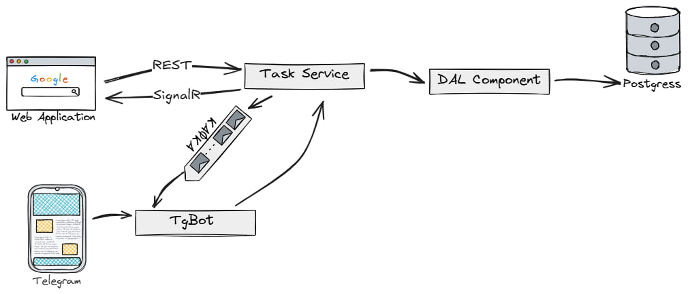

 # KodInternship2025.Backend

## Описание проекта

Этот проект представляет собой комплексное решение, состоящее из трех основных компонентов (весь проект реализован в рамках 48 часового хакатона):
- Бэкенд (текущий репозиторий) - RESTful API на ASP.NET Core 8.0
- [Фронтенд](https://github.com/ivansobolev/KodInternship2025.Frontend) - Веб-интерфейс для управления задачами (Для Менеджера)
- [Telegram бот](https://github.com/ivansobolev/KodInternship2025.TelegramBot) - Интерфейс для работы через Telegram (для Работника)

Система предоставляет полный набор инструментов для управления персоналом и задачами, с возможностью взаимодействия через веб-интерфейс или Telegram (для принятия задач и выполнения их). Бэкенд обеспечивает обработку событий в реальном времени через WebSockets и Kafka.

## Архитектура проекта

### Схема архитектуры



### Компоненты системы

1. **Веб-приложение (Frontend)**
   - Современный React-интерфейс (Для менеджера)
   - Real-time обновления через SignalR
   - Адаптивный дизайн

2. **Backend API**
   - REST API на ASP.NET Core 8.0
   - SignalR для real-time коммуникаций
   - Интеграция с Kafka для асинхронной обработки

3. **Telegram Bot**
   - Альтернативный интерфейс через Telegram (Для сотрудника)
   - Мгновенные уведомления
   - Быстрый доступ к основным функциям

4. **База данных (PostgreSQL)**
   - Хранение всех данных приложения
   - Поддержка сложных запросов
   - Высокая производительность

### Почему именно такая архитектура?

1. **REST API vs GraphQL**
   - REST выбран из-за простоты реализации и широкой поддержки
   - GraphQL был бы избыточен для текущих требований
   - REST лучше подходит для кэширования и масштабирования

2. **PostgreSQL vs MongoDB**
   - PostgreSQL предоставляет ACID-транзакции, критичные для бизнес-логики
   - Структурированные данные лучше хранить в реляционной БД
   - Лучшая поддержка сложных запросов и связей между данными

3. **SignalR vs Socket.io/WebSocket**
   - Нативная интеграция с .NET экосистемой
   - Автоматическое fallback на long-polling
   - Встроенная поддержка масштабирования

4. **Kafka vs SignalR or gRPC**
   - Лучшая производительность при высоких нагрузках
   - Сохранение истории сообщений
   - Горизонтальное масштабирование
   - Если что-то пойдет не так сообщение все равно дойдет
   - Лучше для больших компаний

### Структура проекта

Проект разделен на следующие основные модули:

- **Demo.API**: API-уровень, содержащий контроллеры и интеграции
  - Controllers: REST API контроллеры
  - Hubs: SignalR хабы
  - Kafka: Интеграция с Apache Kafka
  - Managers: Бизнес-логика

- **Demo.DAL**: Уровень доступа к данным
  - Abstractions: Интерфейсы
  - Dto: Data Transfer Objects
  - Models: Модели данных
  - Repositories: Репозитории
  - Migrations: Миграции БД

### Технологический стек

- **Backend**: ASP.NET Core 8.0, C# 12.0
- **Frontend**: React, TypeScript
- **Telegram Bot**: Python
- **База данных**: PostgreSQL
- **Messaging**: Apache Kafka
- **Real-time**: SignalR
- **Контейнеризация**: Docker, Docker Compose

## Настройка и запуск

### Предварительные требования

- Docker и Docker Compose
- .NET SDK 8.0

### Локальная разработка

1. Клонируйте репозиторий:
```bash
git clone https://github.com/ivansobolev/KodInternship2025.Backend.git
```

2. Настройка переменных окружения:
   - Backend: Измените имеющися `.env`

3. Запуск с Docker Compose:
```bash
cd KodInternship2025.Backend
docker-compose up -d
```

4. Или запуск компонентов по отдельности:

Backend:
```bash
cd KodInternship2025.Backend
dotnet restore
dotnet run
```

### Конфигурация

1. **Backend конфигурация**:
   - Database connection string
   - Kafka settings
   - SignalR options
   - CORS policies


### Развертывание

1. **Подготовка**:
   - Настройте CI/CD в GitHub Actions
   - Подготовьте production окружение
   - Настройте SSL сертификаты

2. **Production запуск**:
```bash
docker-compose -f docker-compose.prod.yml up -d
```

3. **Мониторинг**:
   - Проверьте логи контейнеров
   - Мониторинг метрик
   - Проверьте работу всех компонентов